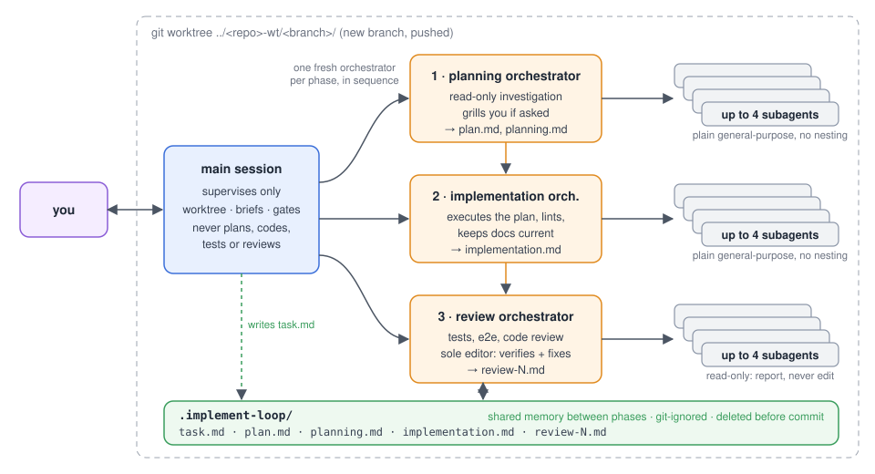

# implement-loop

## Install

```bash
npx skills add Adham-Aly/implement-loop
```

In the installer's menu, choose the global installation: the skill belongs to your agent, not to one project. Start a new session to pick it up.

## Usage

```
/implement-loop <a feature, a bug, a plan you discussed, a tiny change>
/implement-loop <task>, grill me         # get questioned before the plan is written
/implement-loop review                   # another review pass on the current run
```

User-invoked only; agents never trigger it on their own.

## What it is

An agent skill that keeps your main session lightweight. `/implement-loop <task>` runs the task through **planning → implementation → review**, each phase owned by its own orchestrator subagent. The main session only supervises: it creates a worktree, briefs one orchestrator per phase, gates each report, and talks to you.

Works with any coding agent that supports the SKILL.md format: Claude Code, Codex, Cursor, OpenCode, and the rest.

## A run

1. **Worktree.** New branch on a new worktree at `../<repo>-wt/<branch>/`, pushed if there is a remote.
2. **Planning.** Read-only investigation → `plan.md` (including how to verify the change).
3. **Implementation.** Executes the plan, keeps docs current, lints.
4. **Review.** Runs the project's own checks, exercises the change end to end, reviews the diff, fixes what is real. Its subagents only report; the orchestrator alone confirms and edits.
5. **Close.** Summary, then an **offer** to commit and push, and to merge into the default branch and delete the worktree and branch. Nothing happens without your yes, given at the start, mid-run, or at the end. An unattended merge resolves conflicts itself; an interactive one stops and asks.

Phases hand context to one another through `.implement-loop/`, a git-ignored scratch folder in the worktree, never through the main session. The main session writes `task.md` (the task in full, run constraints, grilling answers); each orchestrator reads what came before and leaves a strictly concise context file for the next (`plan.md` + `planning.md`, `implementation.md`, `review-N.md`, one per review pass, never overwritten). The folder is **deleted before the work is committed**; the main session does this when you accept its commit offer.



## Grilling

Ask to be questioned in any wording ("grill me", "ask me questions first") and the planner interviews you before writing the plan: the decisions it must not make for you, and any reading of your request it could have gotten wrong. The main session relays everything verbatim in both directions.

## Defaults and overrides

Say it in the invocation to change it.

| Default | Override example |
|---|---|
| Runs in a new worktree | "just a branch" · "stay on the current branch" |
| Flows through all three phases | "pause after planning so I can approve the plan" |
| Planner assumes and records ambiguities | "grill me" |
| Up to 4 plain general-purpose subagents per orchestrator, no nesting | "review: at most 2" · "let the e2e subagent spawn 2 helpers" |
| Everything inherits the session's model and effort | "planning orchestrator on model X, high effort" |
| Only the main session touches git; commit, push, and merge only after you approve | "commit and push when done" · "commit, push, merge, and clean up when done" |

## Layout

```
skills/implement-loop/
├── SKILL.md                        # main-session workflow
├── planning-orchestrator.md        # brief templates, one per phase
├── implementation-orchestrator.md
└── review-orchestrator.md
assets/                             # README diagram
```

[MIT](LICENSE)
